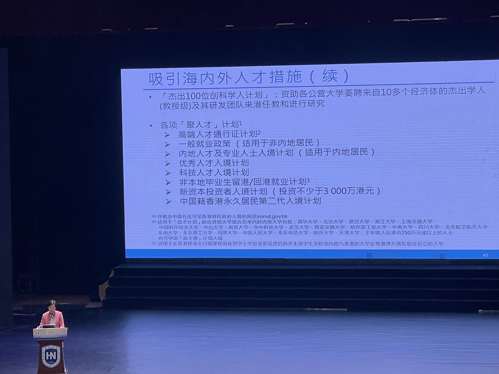
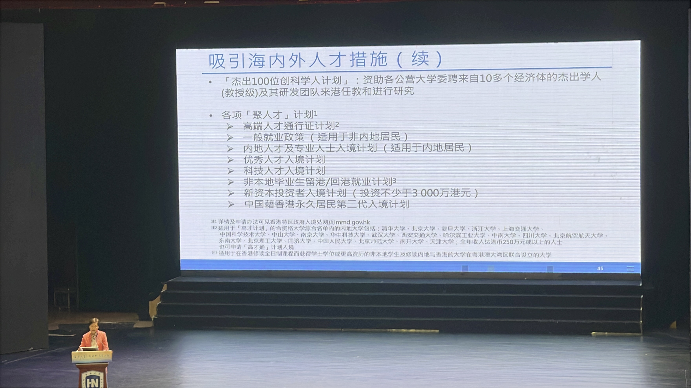
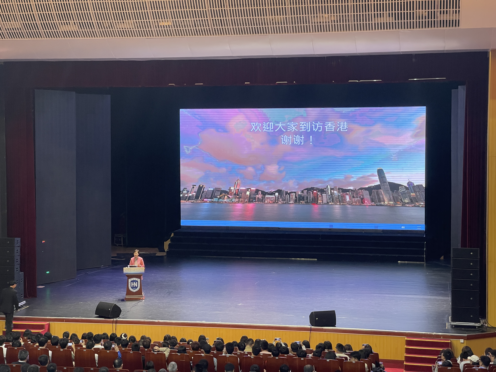

#### 报告主题
党的二十大报告强调“一国两制”是香港保持长期繁荣稳定的最佳制度安排，必须长期坚持。作为香港特别行政区第五任行政长官，林郑月娥任内经历了香港自回归以来最险峻的挑战。在党中央的指导和支持下，依照《宪法》和《基本法》办事，香港局势实现由乱到治的重大转折，将踏上由治及兴的新征程。林郑月娥的专题报告，会从历史回顾，实践经验和个人体会说明全面准确贯彻“一国两制”才能保持香港长期繁荣稳定。她也会分享对香港未来的信心和如何发挥香港“背靠祖国，面向世界”的优势，更好融入国家发展大局

#### 现场感受
林郑月娥被邀请到海大做演讲，一票一座，现场人非常多，林郑月娥详细的讲解了一国两制的具体内容，以及在香港的实施情况，值得注意的是在她执政期间，正是乱港分子最猖狂的时期，2019年爆发港独示威游行等及其恶劣的行为，林郑月娥从香港最高领导人的视角向观众讲述了当时的事件，包括前因后果以及后来的宣布实施国安法等，让观众对当时的情况有了更详细的了解。

