### 搭建KVM环境、安装qemu guest agent


#### 1、配置环境说明

物理主机：Windows11，Intel Core i7-13650HX，VMware Workstation 16 Pro

VMware客户机：Ubuntu16.04

KVM客户机：Windows7 ultimate

注：物理主机要使用Intel处理器，AMD会出现不兼容的问题；KVM客户机可使用Win7，也可以使用Win7旗舰版，提前准备好iso镜像文件


#### 2、安装KVM

##### 2.1 虚拟化技术

我们通常所说的虚拟化主要是指平台虚拟化技术，通过使⽤控制程序（Control Program，也被称为  Virtual Machine Monitor 或Hypervisor），隐藏特定计算平台的实际物理特性，为⽤户提供抽象的、统 ⼀的、模拟的计算环境（称为虚拟机）。虚拟机中运⾏的操作系统被称为客户机操作系统（Guest  OS），运⾏虚拟机监控器的操作系统被称为主机操作系统（Host OS），当然某些虚拟机监控器可以脱 离操作系统直接运⾏在硬件之上（如 VMWARE 的 ESX 产品）。


##### 2.1 KVM介绍

KVM 全称是基于内核的虚拟机（Kernel-based Virtual Machine），它是一个 Linux 的一个内核模块，该内核模块使得 Linux 变成了一个 Hypervisor：

- 它由 Quramnet 开发，该公司于 2008年被 Red Hat 收购。
- 它支持 x86 (32 and 64 位), s390, Powerpc 等 CPU。
- 它从 Linux 2.6.20 起就作为一模块被包含在 Linux 内核中。
- 它需要支持虚拟化扩展的 CPU（即支持Intel VT 或者 AMD-V）。
- 它是完全开源的。

**KVM 中，虚拟机被实现为常规的 Linux 进程，由标准 Linux 调度程序进行调度**；虚机的每个虚拟 CPU 被实现为一个常规的 Linux 进程。这使得 KMV 能够使用 Linux 内核的已有功能。但是，KVM 本身不执行任何硬件模拟，需要客户空间程序通过 /dev/kvm 接口设置一个客户机虚拟服务器的地址空间，向它提供模拟的 I/O，并将它的视频显示映射回宿主的显示屏。目前这个应用程序是 QEMU。

<center></center>

- KVM：运行在内核空间，提供CPU 和内存的虚级化，以及客户机的 I/O 拦截。Guest 的 I/O 被 KVM 拦截后，交给 QEMU 处理。
- QEMU：修改过的为 KVM 虚机使用的 QEMU 代码，运行在用户空间，提供硬件 I/O 虚拟化，通过 IOCTL /dev/kvm 设备和 KVM 交互。
- libvirt：是调用kvm虚拟化技术的接口用于管理的
- 虚拟机配置文件，XML文件，位置 ：/etc/libvirt/qemu/
- 虚拟机硬盘文件，默认位置：/var/lib/libvirt/images/


##### 2.2 VMware设置

（1）按照自身电脑配置设置Ubuntu的硬件参数，内存至少在4GB以上，硬盘越大越好，至少在60GB以上

（2）->编辑虚拟机设置->处理器->虚拟化引擎，这里要勾选虚拟化Intel VT-x/EPT或AMD-V/RVI(V)

<center></center>

但是勾选这个可能会出现虚拟机无法开机的问题


这是因为微软的 Hyper-V 与 VMware Workstation 之间是冲突的，所以你不能二者兼得。因此，如果你要在 VMware 中使用英特尔虚拟化技术，就必须要舍弃 Hyper-V。

如果电脑是win11专业版，可以在网上搜索编辑组策略的方法解决、并在Windows功能界面，将Hyper-V相关的选项全部取消勾选


如果电脑是win11家庭版，需要以管理员身份打开shellcode，运行以下代码

```bash
bcdedit /set hypervisorlaunchtype off
```

并关闭所有Hyper-V相关的服务


如果以上措施还是无法解决问题，可以参考以下博客尝试解决

https://blog.51cto.com/xiaobinbin/5286998

https://www.cnblogs.com/never-say-die/p/16840030.html


##### 2.3 安装KVM

（1）首先看看cpu是否支持kvm虚拟化：

```bash
egrep -c "(svm|vmx)" /proc/cpuinfo
```

 

返回结果大于0即可

（2）安装KVM及相关依赖包

```bash
sudo apt-get install qemu-kvm qemu virt-manager virt-viewer libvirt-bin bridge-utils
```

（3） 启用桥接网络

先备份一套原有配置

```bash
sudo cp /etc/network/interfaces /etc/network/interfaces-bak
```

 对/etc/network/interfaces 配置文件进行更改

```bash
sudo gedit /etc/network/interfaces
```

将以下内容粘贴复制到文件中：

```txt
# Enabing Bridge networking br0 interface
auto br0
iface br0 inet static
address 192.168.1.130
network 192.168.1.0
netmask 255.255.255.0
broadcast 192.168.1.255
#gateway 192.168.1.1   设置网关后， 191.168.1.1 权重是0 在第一位，系统重启后可能无法联网，所以我删掉了这个网关
dns-nameservers 223.5.5.5
bridge_ports eth0
bridge_stp off
```

（4）重启虚拟机  reboot，然后使用ifconfig查看网络配置


（5） 启动KVM虚拟系统管理器：

```bash
sudo virt-manager
```


#### 3、安装qemu guest agent

##### 3.1 Virtio驱动

Virtio驱动程序是KVM虚拟机的半虚拟化设备驱动程序，半虚拟化驱动程序可提高机器性能，减少I / O延迟并将吞吐量提高到接近裸机水平，对于完全虚拟化的计算机，建议使用半虚拟化驱动程序。

这是虚拟机内部代理的基础。

virtio-win-0.1.171： https://fedorapeople.org/groups/virt/virtio-win/direct-downloads/archive-virtio/virtio-win-0.1.171-1/ 

提前下载好放在ubuntu中


##### 3.2 安装win7客户机

（1）点击文件->新建虚拟机 （类似VMware）


<center>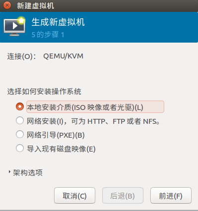</center>
<center>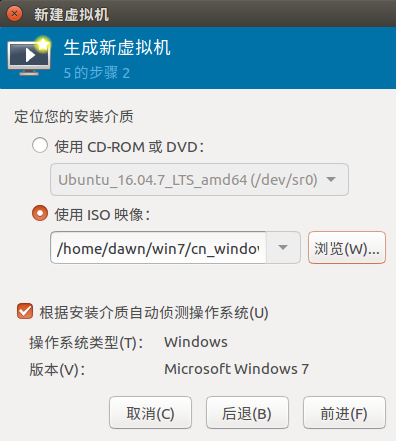</center>
<center>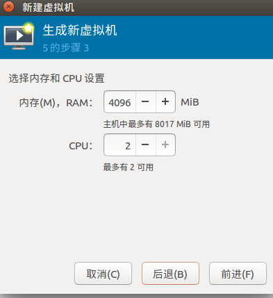</center>


（2）第四步，选择第二个，并点击Manage

<center></center>

（3）新建一个存储池（不创建也可以，这样会安装到默认的位置（ /var/lib/libvirt/images））


<center></center>
<center></center>


目标路径设置为/root/KVM

（4）创建虚拟磁盘（磁盘会在存储池的指定目录下），我将名称命名为windows7a

<center></center>

（4）点击完成，回到第5步，将虚拟机名称命名为windows7

<center></center>


##### 3.3 win7客户机配置

（1）上一步点击完成后，不要直接安装，要先进行虚拟机配置，安装后再配置可能会出现问题，按照下图依次进行配置，每配置一项，点一次应用


<center>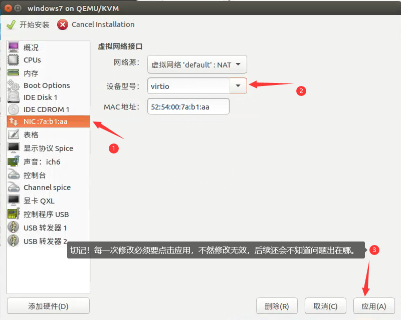</center>
<center></center>


<center></center>
<center></center>


（2）添加Virtio-win镜像文件

<center></center>

<center></center>

（3）安装驱动，两个驱动都要安装，重复两遍即可

<center>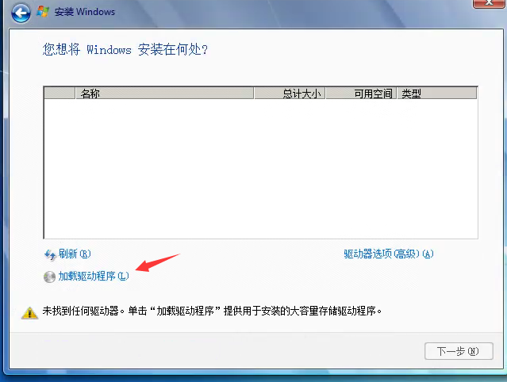</center>
<center>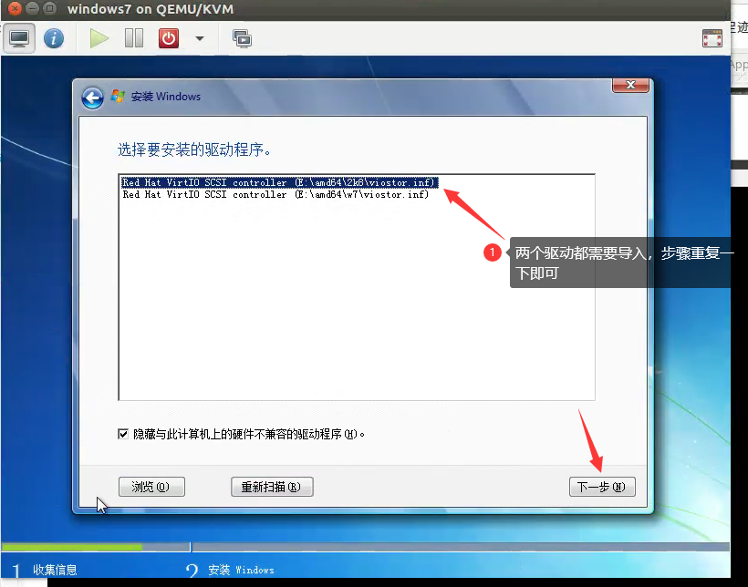</center>

<center></center>
<center>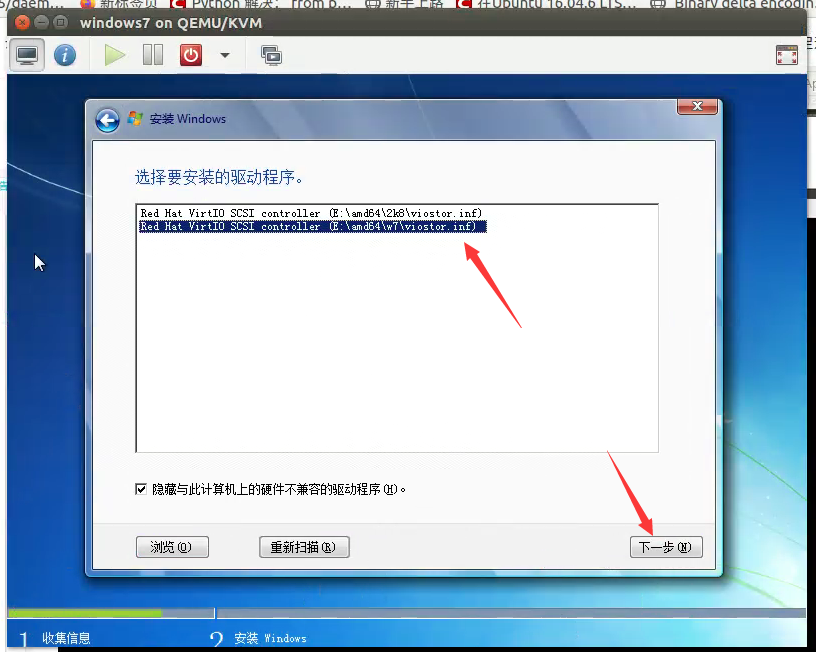</center>


<center>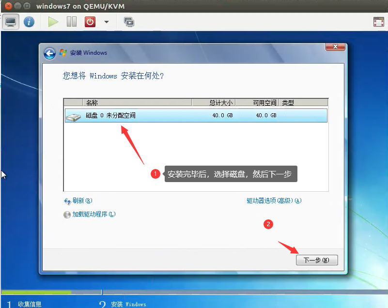</center>

（4）慢慢等Windows安装完毕，开机后准备进行驱动激活程序。注意：安装完毕后，虚拟机不能关闭（因为虚拟机关闭后，配置文件的编辑可能会失败，会出现下次无法开启虚拟机，例如虚拟机开启时报错）。

在虚拟机开机的情况下打开虚拟机配置文件，用gedit打开，文件位置是/etc/libvirt/qemu

```bash
sudo gedit /etc/libvirt/qemu/windows7.xml
```

<center></center>

然后将下列代码插入到<device>列表的最后一行，保存后关闭

```bash
<channel type='unix'>

   <source mode='bind'/>

   <target type='virtio' name='org.qemu.guest_agent.0'/>

   <address type='virtio-serial' controller='0' bus='0' port='2'/>

 </channel>
```

<center>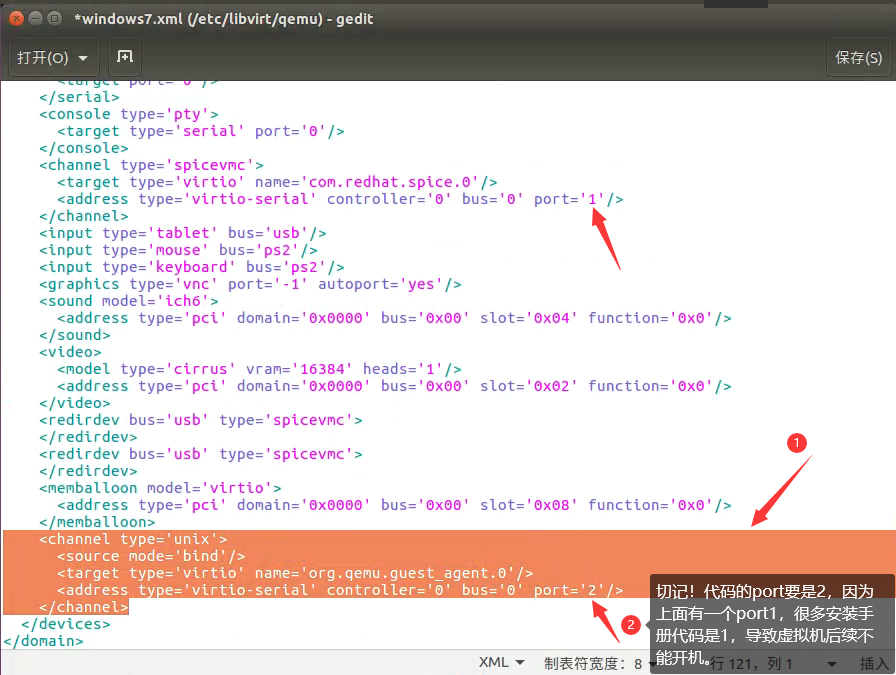</center>


（5）下面进入虚拟机内部操作，如果虚拟机没有网络请不要着急，按照下图所示，一步一步操作即可

首先打开设备管理器，看到如下图所示，有两个PCI和一个网络驱动没有安装，安装步骤如图所示

<center class="half">
    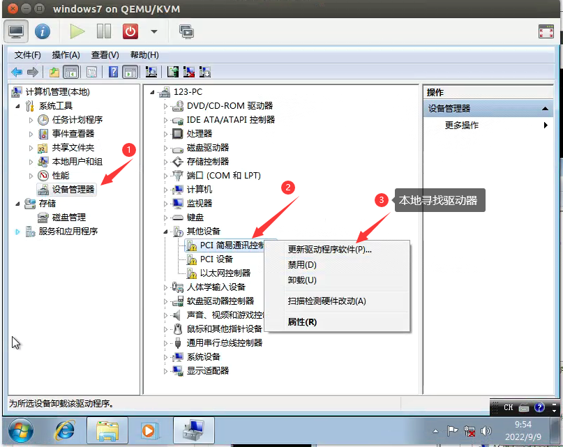
    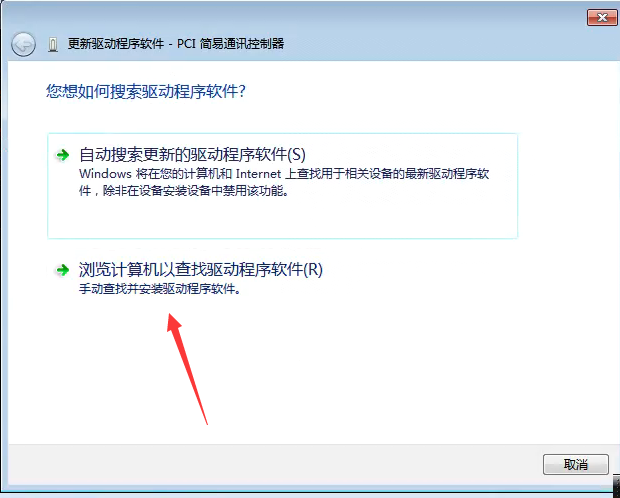
</center>

<center class="half">
    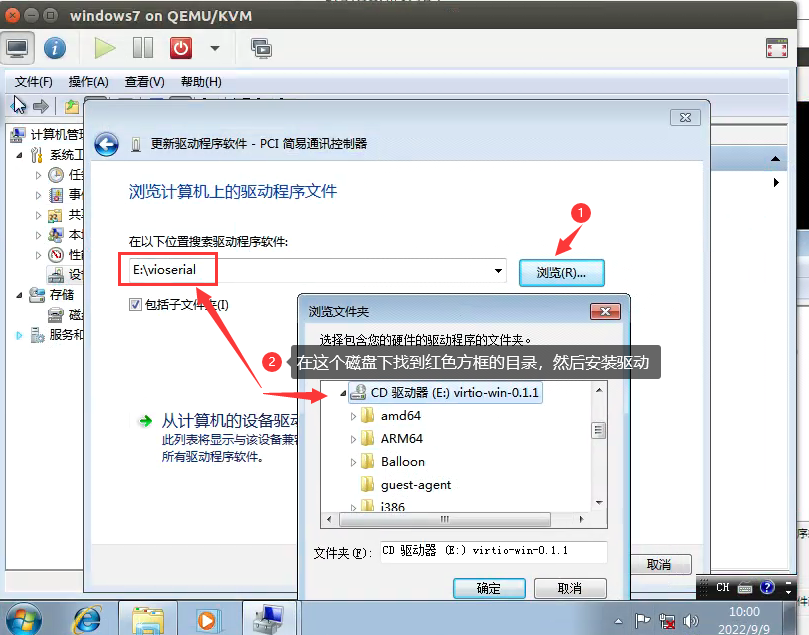
    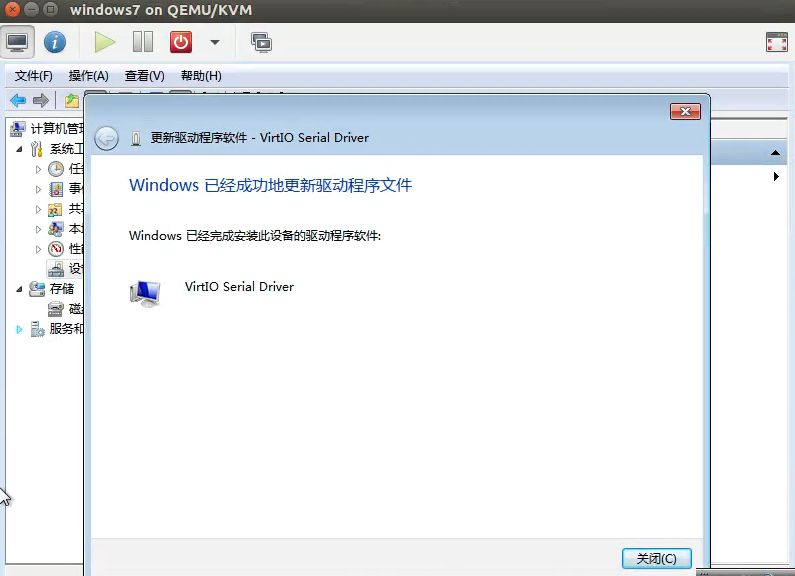
</center>

其他两个步骤相同，只是改变文件夹，分别在Balloon文件夹安装PCI设备驱动，以及在Netkvm文件夹中安装网络设备驱动

<center class="half">
    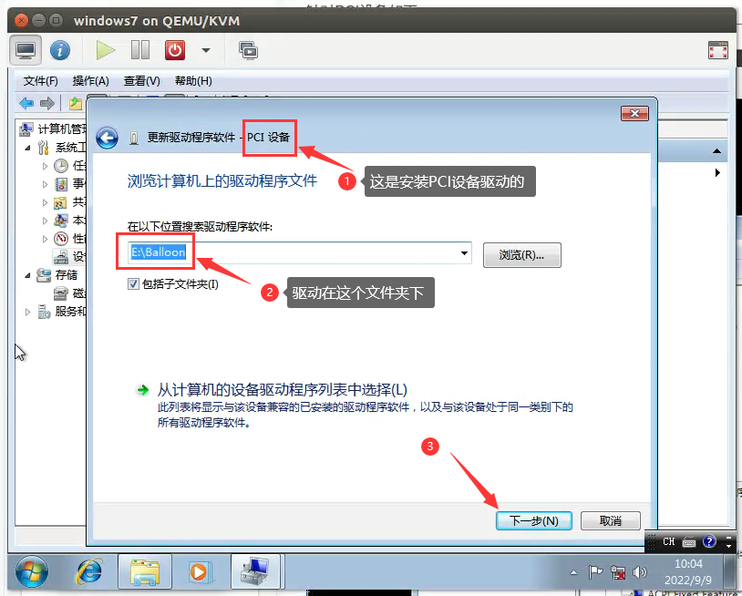
    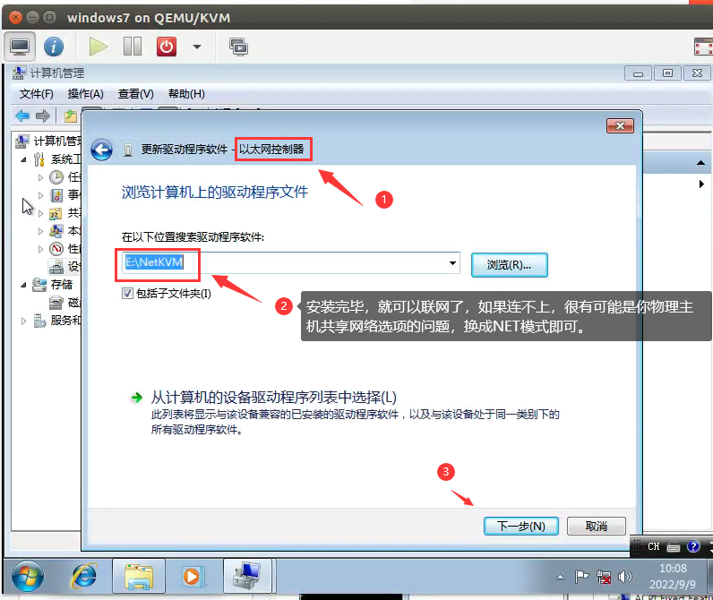
</center>

安装完毕后可以看到下图所示

<center class="half">
    
    
</center>

（6）最后，安装qemu，如下图所示，在virtio-win磁盘下，找到guest-agent文件下的qemu-ga-64文件安装。安装完毕后，整个安装过程就完毕了，后续就是验证是否安装成功。

<center></center>


##### 3.4 验证步骤

（1）通过命令行查看客户机、关闭客户机

```bash
#以下代码需要将代码的windows7改为自己设置的名称
#查看客户机
sudo virsh list --all
#关闭客户机
sudo virsh shutdown windows7
```

<center></center>

<center></center>

（2）进行开机，然后等虚拟机启动后，

```bash
#开机
virsh start windows7
#终端检测
virsh qemu-agent-command windows7 '{"execute":"guest-ping"}'
```

如果返回如下图所示，则安装成功。
<center></center>

注意，如果这个命令如果报错，先不要怀疑自己安装出问题，这可能是正常现象，许多人都遇到过这个问题，请重启一下你的物理主机（ubuntu），物理主机重启后应该就没问题了，如果重启后还报错，请仔细检测全程安装步骤


##### 3.5 程序在桌面的窗口可视化

当程序成功在任务管理器的进程列表时，很有可能是看不到程序窗口的，到时候可能会怀疑程序到底是不是正常按照自己的指令运行了，如下图所示（程序注入成功，但是看不到记事本窗口）：

这种情况下，只需要在设备管理器的“服务”选项找到qemu-guest-agent选项，按照下图所示操作即可

<center></center>

<center></center>

然后再次运行如下图命令，就可以看到窗口了


#### 4、HPC数据的采集

##### 4.1 恶意软件数据集获取

从virusshare上下载了一个针对windows平台上的恶意软件数据集，VirusShare_x86-64_WinEXE_20130711.zip


未完..（下周会继续补充）


 

 